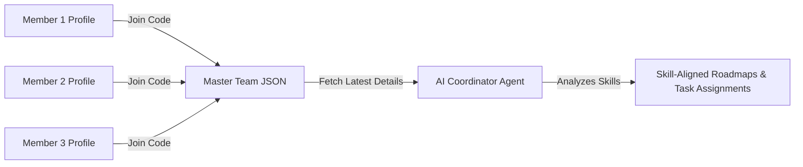

# KAIROS - Team Collaboration & Developer Guide

Welcome to KAIROS! This guide is designed to help team members understand how the platform coordinates teamwork and how our underlying AI engine processes data.

---

## 1. How KAIROS Orchestrates the Team

KAIROS does not just store list items; it treats your team as a single resource pool. It does this by compiling a **Master JSON** file.



### The Master JSON Structure
When you fill out your profile (roles, skills, and experience), KAIROS aggregates it into a structured record for the Team Leader:
```json
{
  "team_name": "Web3 Hackers",
  "members": [
    {
      "name": "Alice",
      "primary_role": "Frontend Developer",
      "experience_level": "Advanced",
      "tech_stack": ["React", "TypeScript", "Vanilla CSS", "Zustand"]
    },
    {
      "name": "Bob",
      "primary_role": "Backend Developer",
      "experience_level": "Intermediate",
      "tech_stack": ["Python", "FastAPI", "PostgreSQL", "Supabase"]
    }
  ]
}
```

---

## 2. Working Together: Key Rules

### 1. Keep Your Profile Updated
If you learn a new library during the hackathon or switch roles, update it in your **Profile page**. The Team Leader can click **"Fetch Latest Details"** to sync it instantly. The AI will then recommend different task distributions based on your new skills.

### 2. Sessions are Created by the Leader
Only the **Team Leader** can create new coaching sessions (inputting the problem statement and idea). Once created, all team members will see the session card on their **Coach page** and can participate in the chat.

### 3. Task Status & Automatic Blockers
- When KAIROS generates the roadmap, it creates a list of tasks.
- If you run into issues, change your task status to **Blocked**.
- **Crucial**: The system will automatically create a blocker. If another member's task depends on yours, their task will also flag as blocked, alerting the team leader and dashboard.

---

## 3. Creating the Pitch Together

The **Pitch Page** is collaborative. KAIROS evaluates:
- Who completed what tasks.
- The strengths and primary roles of each member.
- The overall milestones.
- It then writes specific slides detailing **Team Contributions** (e.g., *"Alice designed the glassmorphic frontend UI, while Bob implemented the FastAPI multi-model fallback router"*).
- You can regenerate slide text or demo steps together until it is ready for submission.
