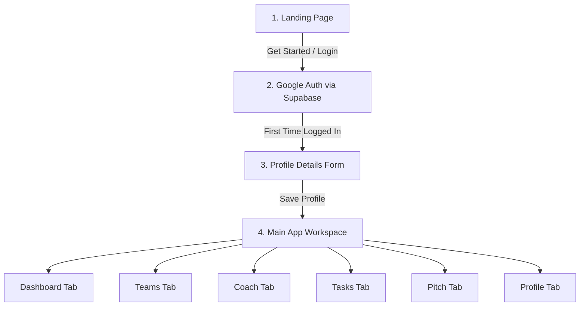

# KAIROS - User Flow Guide

This document describes how a user moves through KAIROS, from landing on the homepage to completing their hackathon project with a generated pitch.

---

## 1. High-Level Flow Chart

---

## 2. Page-by-Step Experience

### Page 1: Landing Page
- **Visuals**: A clean, modern landing page displaying the text: *"KAIROS: Your AI Hackathon Co-Founder"*.
- **Interaction**: A prominent **"Sign in with Google"** button.
- **Goal**: Introduce the app and prompt the user to authenticate.

### Page 2: Mandatory Profile Setup
- **Fields**:
  - **Name**
  - **Primary Role** (Dropdown: Frontend Developer, Backend Developer, Full Stack Developer, AI/ML Engineer, UI/UX Designer, DevOps Engineer, Research & Pitch)
  - **Experience Level** (Beginner, Intermediate, Advanced)
  - **Tech Stack** (Categorized searchable tags like Python, React, PostgreSQL, Docker, etc.)
- **Goal**: Saves this information as a structured JSON object under the user's profile.

### Page 3: Teams Page
- **Features**:
  - **Create Team**: User inputs a Team Name. KAIROS generates a unique 6-character Code (e.g., `KAI-782`). The creator becomes the Team Leader.
  - **Join Team**: User inputs a team code to join an existing group.
- **Syncing (Leader view)**: 
  - The leader sees a list of members.
  - Clicking **"Fetch Latest Details"** pulls the latest JSON profiles of all members and updates a central `master_json` representing the team's combined skills.

### Page 4: Dashboard
- **Features**:
  - Personal profile summary card.
  - Task alerts and blockers checklist.
  - List of joined teams.
  - List of ongoing hackathons.
  - Visual charts showing project completion status.

### Page 5: Coach Page (AI Session Setup)
- **Before generation**:
  - Shows cards of current project sessions.
  - Click **"New Session"** (available to Team Leaders or Solo users).
  - Form asks for: Hackathon Name, Solo/Team selection, Problem Statement (PDF/Docx upload or Text field), and Project Idea.
- **During generation**:
  - A beautiful progress animation runs as the multi-agent system runs checks.
- **After generation**:
  - **Roadmap Pane**: Displays a visual timeline with milestone cards (phases, deliverables, dependencies, risk). The leader can add, edit, or delete milestones.
  - **Chat Pane**: Speak directly to KAIROS to modify the roadmap (e.g., *"Make Phase 2 backend-only"*).

### Page 6: Tasks Page (Execution Area)
- **Features**:
  - Lists all generated tasks categorized by status (Pending, In Progress, Completed, Blocked).
  - Shows task metadata (Assigned member, Deadline, Priority, Dependency).
  - Leaders can assign tasks to members.
  - **Causal Blockers**: If a member marks a task as "Blocked", the system automatically creates a blocker card. If task B depends on task A, and task A is late, task B is automatically marked blocked.
  - **AI Recommendation Engine**: Scans tasks and provides solutions (e.g., *"Reassign Task C to DevOps Engineer since they have finished their work"*).

### Page 7: Pitch Page
- **Features**:
  - Becomes unlocked once the roadmap is generated.
  - **Demo Flow**: Step-by-step path to show judges.
  - **Pitch Outline**: Structured slides and speaking bullet points.
  - **Final Pitch Showcase**: Fully detailed speech draft combining problem, solution, architecture, team contributions, and demo strategy.
  - Chat allows modifying specific slides or talking points.

### Page 8: Profile Edit Page

- **Features**:
  - Allows editing name, role, tech stack, and experience.
  - Saving automatically updates the team leader's master team JSON and updates the Coach's recommendations.
